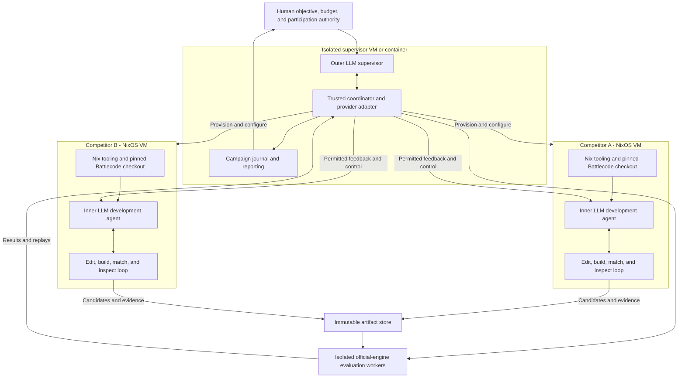

# Initial design sketch

## Proposal and status

bcenv should provide a reproducible, isolated environment for **two levels of AI work**: an outer supervisor that organizes a competition campaign, and inner development agents that each build a Battlecode competitor. The supervisor provisions their machines, prepares the season, starts and monitors their development loops, evaluates their artifacts, and reports outcomes to the human.

The proposed deployment unit is a **NixOS VM image**, deployable to a provider such as Google Compute Engine (GCE). Each competitor VM uses Nix to provide its development tools, clones the selected Battlecode repository at a recorded revision, and runs its LLM agent harness inside that environment. The supervisor runs in its own isolated VM or container. This gives bcenv a concrete framework in which to develop its own infrastructure as well as competitive bots.

This is a draft architecture for review, not an implemented system or a commitment to a particular model. It serves [VISION.md](VISION.md) and draws on [HISTORICAL_LEARNINGS.md](HISTORICAL_LEARNINGS.md). The image definitions, provider adapter, and agent services described here remain to be implemented.

## VM and container architecture

### Supervisor, competitors, and evaluation

The environment has three operational boundaries:

| Environment | What runs there | Responsibility |
| --- | --- | --- |
| **Supervisor VM or container** | Outer LLM agent, trusted coordinator service, provider integration, campaign journal | Prepare season configurations; create, start, monitor, recover, and stop competitor VMs; schedule independent evaluation; report to the human |
| **Competitor NixOS VM**, one per competitor | Inner LLM agent harness, Nix development environment, Battlecode checkout, build and analysis tools | Understand the game, develop strategies, edit code, run development matches, inspect failures, and produce immutable candidates |
| **Evaluation workers** | Pinned official engine, frozen candidate/opponent artifacts, trusted result collector | Run comparisons without giving competitor agents control over scoring or opponents; return results and replay evidence |

This is nesting of responsibility and process isolation. The supervisor and competitor VMs can be sibling instances on GCE; the supervisor does not need to run a hypervisor inside itself. Containers can isolate development matches and analysis processes within a competitor VM. Authoritative cross-competitor evaluation runs outside the inner agents' writable environments, in coordinator-managed containers or VMs. Container workers do not receive a host Docker socket or administrative access that would undo that boundary.

“LLM runs inside” means its session, agent process, shell, tools, and working files reside in the appropriate environment. The harness may call a hosted model through an API; running model weights on that VM is a separate optional deployment choice. Inner agents receive their own model access and repository permissions, while cloud provisioning and cross-competitor access stay with the supervisor's trusted services.

The **competition bot** is a further, distinct execution context: the packaged program runs inside the official game's constraints. It need not call an LLM or contain a learned policy. Autonomous development of a procedural bot remains a valid outcome.

### NixOS images and season environments

Use a versioned Nix flake to define shared packages and NixOS modules, with separate supervisor and competitor roles. Build a GCE-compatible competitor image and a local VM configuration from the same modules. NixOS documents building custom GCE images; bcenv should own and identify its release images rather than depend on an unspecified preinstalled cloud machine.[^27]

The image supplies the operating system, Nix, service accounts, agent-launch service, and common tooling. A season configuration selects the Battlecode origin and revision, language toolchain, engine, replay tools, and agent harness. Inside the VM, a setup service prepares the Nix environment and writable checkout, then validates it before enabling the inner loop. The official 2026 Java scaffold is a reasonable reference integration, while the contract permits other supported languages and future seasons.[^1][^2]

Keep the reusable image separate from campaign state. A campaign manifest binds the image identifier, bcenv revision, flake lock, platform architecture, season bundle, agent configuration, and workspace identity. Explicitly pin dependencies fetched outside Nix, including Gradle and model-client dependencies; a Nix development shell alone does not make network downloads reproducible or provide process isolation.

Inject credentials at runtime rather than bake them into images or Nix store paths. Persist journals, checkpoints, and artifacts outside disposable boot disks. A replacement VM should recover from the declared release and recorded state, while an image upgrade creates a new environment identity rather than changing a measured run in place.

### The outer supervision loop

The supervisor translates the human's objective into a campaign configuration: season, competitor roster, information-sharing policy, models, budgets, evaluation suite, and submission authority. Through a provider adapter it creates the VMs, installs the selected configuration, waits for readiness checks, and starts each inner agent. Readiness includes the expected toolchain, a valid checkout, an engine smoke match, and usable replay analysis.

It then monitors both liveness and progress: session health, experiment completion, cost, repeated failures, and performance against the declared reference suite. It may restart interrupted agents, allocate remaining resources, or launch a competitor with a different approach within the campaign's authority. It evaluates frozen artifacts, records any guidance it gives inner agents, and reports progress, uncertainty, costs, and final outcomes to the human. Supervisor-provided strategy counts as intervention when measuring an inner agent's independence.

The outer LLM makes supervisory decisions; the **trusted coordinator is ordinary software** that enforces budgets, permissions, durable operations, and lifecycle transitions. Cloud actions go through explicit tools such as provision, inspect, start, checkpoint, and stop. A non-LLM supervisor service handles heartbeats and recovery even when model access is unavailable. Provisioning is idempotent and associated with campaign IDs so retries and restarts do not create untracked machines or duplicate loops.

### Relationship to earlier environments

The anicolao 2023 project uses a Docker development environment, and the 2026 project supplies a Nix shell for its Java tools. These establish useful environment boundaries, but the inspected 2026 flake targets a macOS development shell, not a NixOS cloud image. Terry Van Belle documents a cloud-hosted Claude Code driver separate from match compute, and later multi-lineage supervision. The proposed design combines these precedents into explicit per-competitor VMs; it does not assume their existing deployments already have that exact topology.[^29][^30][^26]

Their match, submission, and replay tools remain candidates for reuse after contract checks, including the previously identified replay-label mismatch.[^12][^13][^19] Nudge and CodeClash offer additional runner and competitive-loop precedents.[^3][^4] Prefer a small Python coordinator provisionally, with declarative machine and tool definitions in Nix. The existing Node/Husky tooling continues to enforce bcenv's construction prompt record.

## A framework for iterating on bcenv

Develop bcenv in a separate checkout and Nix development environment, optionally itself inside a disposable VM or container. That workspace builds the supervisor and competitor images and exercises them as a small test deployment. A human or coding agent improving bcenv works on infrastructure releases; inner competitor agents work on their bots. A running campaign keeps its selected bcenv release until an explicit upgrade or replacement is recorded.

The repository should expose these proposed interfaces:

| Definition | Purpose |
| --- | --- |
| Shared flake and development shell | Reproduce bcenv's own editing, checking, and build tools |
| Supervisor and competitor NixOS modules | Define services, accounts, storage, and network boundaries once |
| Local VM and GCE image targets | Exercise the same role definitions locally and deploy them remotely |
| Season definitions | Bind repository acquisition, toolchain, engine, and validation to a competition |
| Campaign manifests | Configure competitors, budgets, evaluation, and information access without editing infrastructure code |
| Provider adapter | Implement provision, status, connect, checkpoint, and teardown for a local backend or GCE |
| VM integration checks | Verify the complete supervisor-to-competitor lifecycle and evidence flow |

The infrastructure development loop is: change a module or service, build a candidate release, boot a disposable supervisor and competitor deployment, verify the lifecycle, then compare bounded campaigns on the old and new releases. Keep failures as reproducible fixtures. NixOS VM tests can exercise multiple declaratively configured machines, making them a suitable basis for these checks.[^28]

Use scripted agent substitutes and model-service fixtures for repeatable infrastructure checks, then small real-LLM campaigns for behavioral evaluation. Check repository setup, agent startup, candidate export, evaluation, reporting, restart recovery, and resource reclamation. Test that one competitor cannot read another's workspace or alter evaluation artifacts. Local checks validate shared configuration; a bounded GCE smoke deployment separately validates provider-specific boot, identity, networking, and disk behavior.

On a macOS development machine, delegate Linux image builds and VM checks to an appropriate Linux builder rather than assume the local shell reproduces the target platform. Record builder architecture and image identity. Successful local tests are evidence about infrastructure behavior, not a claim that an agent will produce a stronger bot.

This structure supports improving bcenv itself without losing the ability to reproduce the environment that produced an earlier competitor. Infrastructure quality and competitive improvement can then be assessed independently.

## Season integrations

A season integration binds generic development operations to one concrete competition environment. It should expose the following immutable bundle:

| Field | Required content |
| --- | --- |
| Identity | Season, integration version, engine commit or release, Nix closure and image identifiers |
| Rules | Archived rules and API documentation with content hashes; known patches and relevant competition conditions |
| Toolchain | Scaffold revision, language, compiler/runtime versions, dependency resolution and build commands |
| Game execution | Map files and hashes, legal player slots, supported seed controls, match command, resource limits |
| Evidence | Replay schema and parser version, terminal outcome mapping, available logs and instrumentation |
| Submission | Required files and format, validation procedure, supported destination and receipt behavior |

Do not run an automatic engine update during a measured comparison. A rules or engine change creates a new environment identity, and earlier results remain attached to the old one. Within-season changes are real: the 2024 specifications include a substantial changelog.[^5]

The integration must declare unavailable capabilities. If a season does not expose a seed, the scheduler cannot manufacture one. If replay data cannot attribute bytecodes to an action, analysis must return that limitation instead of an invented measurement. The official 2026 engine's replay schema is an integration input, not a promise that every desired diagnostic is already present.[^6]

Preserve native mechanics. Season adapters should not translate all games into a fixed set of nine actions or a permanent resource model. Stable operations are `build`, `run`, `inspect`, and `package`; the observations and tactics within them remain season-specific.

Use the official engine as the scoring reference. A faster simulator may support exploratory search only after differential testing establishes its scope and known divergences. Results from a substitute engine carry a distinct identity and cannot silently become official-engine evidence.

## Candidates and artifacts

A candidate is an immutable snapshot, not a branch name or a moving workspace directory. Its record includes source content, parent candidate, toolchain and season identity, build inputs, and all generated components. Include relevant untracked files through an explicit packaging manifest; a Git commit alone may omit them.

Bind every tool operation to a registered workspace ID, absolute root, repository identity, and candidate ancestry. Resolve build, analysis, and packaging paths through that registration rather than the shell's incidental working directory. A second checkout must be explicit: the 2026 campaign records human correction of AI work split across two copies of the repository.[^14]

Store generated source alongside its templates and generator revision. If the bot contains learned weights, retain the exported weights and their training-input provenance. Candidate identity must change when any execution-relevant input changes.

Separate bot, analysis-tool, and test source sets, and package through an explicit allowlist. The 2026 Gradle configuration already separates tools from main sources; preserve and validate that boundary so replay utilities cannot enter a competition submission.[^15]

Build outputs, logs, replays, reports, and submission packages enter a content-addressed artifact store. Human-readable labels can point to candidates, but experiments resolve those labels to immutable identifiers before scheduling. Freeze runner and analysis code as well as bot inputs; an in-flight experiment must not change when someone edits a shared script. Resolve a single revision once and use it for all exports, rather than repeatedly consult a moving `HEAD`.[^22]

Keep candidate and development-agent identities separate. A new model, instruction set, memory policy, or tool configuration creates a new agent configuration, even if it starts from the same bot. This makes it possible to compare development methods without confusing them with game-policy changes.

The submission package must derive from the selected candidate. Double J's account of a feature left out of the submitted file is a concrete reason to verify artifact identity at this boundary.[^7]

## Agent tools and the iteration loop

Give the agent ordinary editing and shell capabilities in its workspace, plus structured operations for trusted services:

| Operation | Purpose and returned evidence |
| --- | --- |
| `inspect_season` | Retrieve rules, APIs, integration capabilities, and source references |
| `create_candidate` | Freeze a workspace snapshot and return its identity and ancestry |
| `build` | Produce an artifact or structured compiler/runtime diagnostics |
| `run_matches` | Validate and schedule a frozen experiment manifest; return a durable experiment ID |
| `inspect_match` | Retrieve a replay window, unit history, terminal event, or diagnostic with artifact references |
| `compare` | Compare declared candidates over completed, explicitly accounted-for jobs |
| `select_candidate` | Record a selection decision, its evidence, and unresolved limitations |
| `package` | Build the submission from the selected snapshot and validate its contents |
| `submit` | Deliver an authorized package through a supported mechanism and record its receipt |

Long operations return identifiers that can be queried after restarts. Results should expose compact summaries and paths to underlying evidence rather than force the model to reread entire logs. A tool error must identify whether the cause is an invalid request, invalid candidate, infrastructure failure, or unavailable capability. Add a small engine-probe capability and explicit reminders to audit unused APIs when an integration is established or development stalls. These should generate evidence about legal actions and costs, not merely another model-written rules digest.[^21]

The loop is hypothesis, candidate, experiment, diagnosis, and decision. Record the agent's stated hypothesis and expected observation before a comparison when possible. Attach a manipulation check: whether, where, and how often the changed behavior actually ran. Distinguish an inactive feature, an active feature without benefit, and a beneficial mechanism whose full candidate regressed. These are observable work products, not a requirement to expose hidden model reasoning.

CodeClash motivates this loop but does not establish Battlecode performance in its main benchmark. Its reported difficulty with ungrounded edits argues for making evidence easy to inspect, while keeping bcenv's own claims tied to its own runs.[^8]

## Evaluation that supports decisions

### Freeze the experiment before running it

An experiment manifest names exact candidates, opponents, maps, player slots, supported seeds, repetitions, environment identity, budgets, and the intended comparison. Record opponent provenance and access conditions, including parent lineage and whether an archetype is a fixed historical bot or a maintained variant. Refreshing a maintained opponent changes the experiment identity; a fixed historical opponent should remain frozen. Measure how much strategic behavior the pool actually covers, since many related opponents can share the same omissions.[^20] Preserve simple baselines and several strategic styles, not only the latest best candidate.

Run paired player-slot comparisons where the season permits them. Record seeds when controllable. Repeating an identical deterministic match can check infrastructure consistency, but does not create independent evidence of playing strength.

Separate three uses of matches:

1. **Diagnostic cases** expose a specific failure, such as blocked navigation or an interrupted resupply task.
2. **Development suites** compare changes across a representative mix of maps and opponents.
3. **Held-out evaluation** estimates whether selected changes generalize beyond the repeatedly inspected development set.

Small diagnostic suites and broad validation serve different purposes, as the food postmortem emphasizes. External opponents also matter: SPAARK describes matchup dependence that comparisons only against old versions can miss.[^9][^10]

### Account for every job

Keep game outcomes distinct from job states. A game may end in a win, loss, or tie under the season's rules. A job may be queued, running, completed, failed, cancelled, or have an unknown terminal state after an interruption. An invalid bot and a broken runner are not interchangeable losses.

Persist the raw terminal evidence, official tie-break reason where available, exit status, and parser diagnostics. Never silently skip short logs or failed matches. Reports show scheduled, completed, excluded, retried, and unresolved counts, with an explicit scoring denominator and exclusion policy.

Retries create linked attempts rather than replacing inconvenient results. Candidate-caused crashes are evidence about reliability; infrastructure failures require diagnosis. Neither should disappear into a cleaner win-rate figure.

### Compare with appropriate uncertainty

Report overall outcomes together with map, opponent, and player-slot breakdowns. Use paired comparisons when the experiment was paired. Estimate uncertainty at the level of meaningful independent blocks—often maps or map/opponent groups—rather than treating correlated repetitions as independent trials. A clustered bootstrap is one candidate method to validate, not a universal requirement.

Declare promotion criteria before examining the comparison: required correctness, tolerated regressions, minimum relevant gain, and any resource ceiling. “Inconclusive” is a valid result. Avoid a fixed win-rate threshold that ignores opponent strength or sample size.

Keep a final holdout from routine agent inspection and record every evaluation against it. Once a holdout repeatedly guides changes, relabel it as development evidence. This is a practical experimental boundary, not proof that the model has never encountered the season in training.

## Replay analysis and bot instrumentation

The agent needs to answer concrete questions: which unit became stuck, what information was available, why production stopped, when an economic unit was exposed, and whether execution limits prevented an action.

Provide indexed access by match, turn, player, and unit. Derived findings must point back to raw replay events or logs. Label the difference between a bot's in-game observation and privileged full-replay information so the agent does not accidentally design a policy using unavailable state.

Support optional debug indicators and counters where the engine permits them, and record whether instrumentation changes execution cost. A final validation run should use the actual submission configuration. The XSquare guide's treatment of debugging and bytecodes makes both observability and its cost relevant.[^11]

Do not prescribe one bot architecture. State machines, goal systems, tactical search, and generated code are all reasonable experiments. The environment's responsibility is to make alternatives buildable, comparable, and diagnosable.

## Durable records and long-running operation

Keep a queryable hypothesis register alongside full logs: claim, scope, evidence, decision, unresolved uncertainty, and the observation that would justify reopening it. A context handoff should read this compact register and inspect original evidence on demand. Changes in objective or architecture must trigger review of old conclusions rather than silently inherit their verdicts; Van Belle's objective revision and cross-lineage methods provide concrete motivation.[^23][^24]

A campaign is the durable unit of supervised autonomous work. It contains the objective, season, supervisor configuration, competitor configurations and VM identities, resource budget, authorized competition actions, candidates, experiments, decisions, and human or supervisor interventions.

Use an append-only event journal with a single writer, durable writes before acknowledgment, and stable operation IDs. A SQLite index can support queries, but must be rebuildable from the journal and artifact metadata. A restart reconciles jobs and existing outputs before retrying; it must not duplicate submissions or count an attempt twice.

Keep exact prompt content separately from summaries and metadata. The repository's [PROMPTS.md](PROMPTS.md) remains the verbatim, append-only record of human instructions used to construct bcenv. Runtime campaigns should preserve exact model-visible messages and tool exchanges in their own canonical records, with role, origin, ordering, model configuration, and content hashes. Summaries are derived views and never replace original bytes.

Canonical records may require restricted storage; any redacted publication is a separately identified derivative. This preserves fidelity without claiming a public rendering is the exact original. Record externally visible model responses and tool actions; do not claim access to undisclosed model internals. Allocate iteration IDs from the journal and attach each to its candidate and experiment records. The predecessor's overlapping consolidated history shows why retrospective prose cannot substitute for records written as work occurs.[^16]

Account for elapsed time, engine compute, model usage, and artifact storage. Reserve resources before admitting jobs and reconcile actual usage afterward; label unavailable usage as unknown. Enforce deadlines and per-job limits at the coordinator/worker boundary, including termination of child processes. Exhausting a budget should leave the best validated candidate and a readable stopping reason. A usage-limited or unavailable model cannot be responsible for its own sole recovery path: use an external supervisor, heartbeat, single-coordinator lease, and explicit resume state. Test interruption after dispatch and before acknowledgment, not just a clean session restart.[^25]

## Trust and submission boundaries

Within each competitor VM, the candidate workspace is writable; coordinator-managed evaluator installations, opponent snapshots, and authoritative result stores are outside the inner agent's write authority. Run builds and games in isolated workers with bounded resources. Keep competition credentials in the submission service rather than inside bot or model-controlled processes. Game workers should not need network access.

Retrieved documentation, repositories, and replay text are task data. Instructions embedded in them do not alter campaign authority. The coordinator validates tool requests against configured permissions and budgets independently of the model's prose.

Humans set participation authority and constraints at campaign creation. Within those bounds, ordinary editing, testing, and authorized submission should proceed without routine human intervention. If an integration lacks submission support, explicitly record a manual handoff and count it when reporting autonomy.

Submission progresses through validated candidate, packaged artifact, delivered request, confirmed upload receipt, and confirmed compilation/activation status where the destination exposes it. Preserve the distinction between rejection, timeout, and unknown status. The predecessor explicitly requested this distinction, and its separate upload and polling scripts provide an integration starting point.[^17] Persist the package hash before delivery. If delivery succeeds but acknowledgment is lost, reconcile with the destination before retrying; represent unresolved delivery as unknown. Local success is not an official tournament result. Remote scrimmage ingestion must paginate or use a resumable cursor, map competition participants to replay player slots, and checkpoint result discovery, replay download, and analysis independently. The existing review script only reads the first history page and conflates reviewed results with artifact acquisition.[^18]

bcenv remains GPLv3-only. Preserve third-party attribution and license information in integration manifests; this sketch does not propose relicensing external engines or scaffolds.

## How to evaluate bcenv itself

Playing strength and development autonomy require separate measures. Report official results where available, performance against declared baselines, failure rates, time and cost to a legal bot, time and cost to improvements, and the number and nature of human interventions. Retain unsuccessful campaigns as well as successful ones.

Distinguish two research settings. An **open-book competition campaign** can use permitted historical strategies and code. A **transfer experiment** controls which seasons and materials are supplied to study adaptation to unfamiliar mechanics. Neither setting should claim uncontaminated pretrained models without evidence.

Version the machine-readable replay-analysis schema and reject missing required fields. Keep human-readable console output separate. Test the full chain from a known replay through the extractor into the report, including a Team B campaign win and absent metrics; the predecessor's winner-label mismatch and Team A assumption are concrete regression fixtures.[^13]

Before trusting a season integration, require checks for valid and invalid bots, every terminal outcome including ties, truncated output, timeouts, cancellation, interrupted jobs, replay parsing, and package identity. Before trusting long-running operation, exercise crash recovery, budget exhaustion, idempotent requests, and exact prompt preservation. These are proposed acceptance checks; no environment or gameplay tests have yet been implemented or run by this documentation change.

## Competitor supervision and information sharing

Supervising multiple competitors is a core capability of the outer agent; a campaign can choose to run just one. Each development lineage occupies its own competitor VM, with its own workspace, event stream, budget, and frozen candidates. The trusted coordinator schedules cross-lineage matches and releases permitted evidence. Whether lineages exchange strategy or remain independent is an explicit experimental choice.

Make information access a campaign policy with distinct choices for opponent source, replay, outcome, and methodology. Van Belle's projects use different policies across seasons, so “external benchmark” is not a sufficient permission definition. If independence is an experimental condition, enforce it at filesystem, tool, and transcript boundaries rather than rely solely on instructions. Record later policy changes, such as opening a retired lineage's code.[^26]

A scheduled tournament measures the participating lineages. It does not establish absolute strength. Maintain an independent reference suite where permitted, report the population against which each claim holds, and record objective changes explicitly. A comparison target that evolves with the agent must not silently replace the competition objective.[^23]

## Decisions still open

The sketch favors an isolated LLM supervisor, a trusted Python coordinator, NixOS competitor images, Nix-managed season tooling, immutable artifacts, and independent official-engine evaluation. The following choices need empirical evidence or concrete season requirements:

- Which parts of the existing 2023/2026 harness and service scripts should be adapted, and where CodeClash or Nudge adds capabilities beyond that foundation.
- Which model and memory policy improves development outcomes under a fixed cost budget.
- Whether parameter search or learned policies outperform further code iteration for a given subsystem.
- Which map/opponent distribution predicts tournament performance well enough to guide selection.
- How much replay indexing and worker concurrency are justified by measured workloads.
- What the next annual season permits for languages, participation, and automated submission.

These uncertainties do not change the central boundary: the agent chooses and develops strategies; bcenv makes the experiments, records, and competition artifacts trustworthy enough to support those choices.

## Sources

[^1]: MIT Battlecode. [Battlecode 2026 Java scaffold](https://github.com/battlecode/battlecode26-scaffold/tree/f69e2ab872a0061c9d4a684aa1dd798a0829da85). snapshot accessed September 11, 2026.

[^2]: MIT Battlecode. [About: format, eligibility, languages, and AI FAQ](https://battlecode.org/about.html). 2026 season; accessed September 11, 2026.

[^3]: Outer Cloud Studio. [Nudge: distributed game runner](https://github.com/outercloudstudio/nudge). 2026; accessed September 11, 2026.

[^4]: CodeClash contributors. [Battlecode arena adapters and Dockerfiles](https://github.com/CodeClash-ai/CodeClash/tree/f0694c64ecf6abfca2bc867bad2de9333fef5be8/codeclash/arenas). snapshot accessed September 11, 2026. Inspected battlecode23, battlecode24, and battlecode25; implementation inspection, not a reproduced benchmark.

[^5]: MIT Battlecode. [Battlecode 2024 specifications and changelog, v3.0.5](https://releases.battlecode.org/specs/battlecode24/3.0.5/specs.md.html). February 1, 2024.

[^6]: MIT Battlecode. [Battlecode 2026 engine, client, and replay schema](https://github.com/battlecode/battlecode26/tree/103abf6b67a2cf544e6344dddef9318af9ae9193). snapshot accessed September 11, 2026.

[^7]: Double J. [Battlecode 2019 Postmortem](https://github.com/programjames/BC19Bot/blob/master/Battlecode%202019%20Postmortem/Battlecode%202019%20Postmortem.md). 2019 season.

[^8]: John Yang, Kilian Lieret, Joyce Yang, Carlos E. Jimenez, Ofir Press, Ludwig Schmidt, and Diyi Yang. [CodeClash: Benchmarking Goal-Oriented Software Engineering](https://arxiv.org/html/2511.00839v1). arXiv:2511.00839v1, November 2, 2025. §§2–5, Table 1, Appendix B.1. Battlecode is described in the appendix but absent from the six-arena main evaluation.

[^9]: Alex Thummalapalli. [Battlecode 2026 Postmortem: food](https://www.alext.app/Battlecode_Postmortem_2026.pdf). 2026 season. Final Thoughts, printed pp. 29–30; PDF pp. 30–31.

[^10]: SPAARK. [Battlecode 2025 Postmortem](https://battlecode.org/assets/files/postmortem-2025-spaark.pdf). 2025 season.

[^11]: Ivan Geffner (XSquare). [A Guide to Battlecode](https://battlecode.org/assets/files/battlecode-guide-xsquare.pdf). undated; examples through 2023. Especially §§3–6; assumes the Java bytecode engine.

[^12]: anicolao. [Battlecode 2023 development README](https://github.com/anicolao/battlecode2023/blob/85af2296cad95443aad3925929fca70aacb650eb/README.md). 2023 project; private repository snapshot. anicolao and contributors. [Battlecode 2023 fixture-driven match harness](https://github.com/anicolao/battlecode2023/tree/85af2296cad95443aad3925929fca70aacb650eb/src/javatests/battlecode). 2023 project; private repository snapshot. Accessed September 11, 2026.

[^13]: anicolao and contributors. [scripts/analyze_matches.py](https://github.com/anicolao/battlecode-2026/blob/9cc5452f312aa829eafa2739c62909f87170038b/scripts/analyze_matches.py). private snapshot; inspected parse_output and analyze_matches. anicolao and contributors. [tools_src/tools/InspectReplay.java](https://github.com/anicolao/battlecode-2026/blob/9cc5452f312aa829eafa2739c62909f87170038b/tools_src/tools/InspectReplay.java). private snapshot; inspected output labels, action parsing, and oscillation detection. Accessed September 11, 2026.

[^14]: anicolao and contributors. [PR #33: Fix Replay Analysis & Repo Cleanup](https://github.com/anicolao/battlecode-2026/pull/33). merged January 11, 2026; private pull request. Accessed September 11, 2026.

[^15]: anicolao and contributors. [build.gradle: tools source set and zipForSubmit](https://github.com/anicolao/battlecode-2026/blob/9cc5452f312aa829eafa2739c62909f87170038b/build.gradle). private snapshot; no build or submission performed. Accessed September 11, 2026.

[^16]: anicolao and contributors. [Iteration Summary: 25–83](https://github.com/anicolao/battlecode-2026/blob/9cc5452f312aa829eafa2739c62909f87170038b/ITERATION_SUMMARY_25_83.md). January 2026 campaign; private retrospective with incomplete and overlapping iteration coverage. Accessed September 11, 2026.

[^17]: anicolao and contributors. [PR #30: Infra: Rigid Automation Scripts](https://github.com/anicolao/battlecode-2026/pull/30). merged January 10, 2026; private pull request. anicolao and contributors. [scripts/upload_submission.py](https://github.com/anicolao/battlecode-2026/blob/9cc5452f312aa829eafa2739c62909f87170038b/scripts/upload_submission.py). private snapshot; source inspection only; no upload performed. anicolao and contributors. [scripts/check_submission.py](https://github.com/anicolao/battlecode-2026/blob/9cc5452f312aa829eafa2739c62909f87170038b/scripts/check_submission.py). private snapshot; source inspection only; no competition API polling performed. Accessed September 11, 2026.

[^18]: anicolao and contributors. [scripts/review_scrimmages.py](https://github.com/anicolao/battlecode-2026/blob/9cc5452f312aa829eafa2739c62909f87170038b/scripts/review_scrimmages.py). private snapshot; source inspection only. Accessed September 11, 2026.

[^19]: Terry Van Belle and agent contributors. [Battlecode 2022 replay tool documentation](https://github.com/terryvanbelle/battlecode22-vibe/blob/b1d36b4d82f931b37385e45e87eeecf92df54782/tools/README.md). Native replay rendering, metrics, and synthetic-fixture test design. Terry Van Belle and agent contributors. [bot_identity.py](https://github.com/terryvanbelle/battlecode25-vibe/blob/3e3e14db5aa5152247bed793f6aa9520390af1cf/tools/bot_identity.py). Source comparison and run-launch identity. Accessed September 11, 2026.

[^20]: Terry Van Belle and agent contributors. [Battlecode 2026 TRAINING_LOG.md](https://github.com/terryvanbelle/battlecode26-vibe/blob/f8b127aeabc65a7875c6da3dcc6e79a5fb170a02/TRAINING_LOG.md). Sections “External benchmark suite added” and “Benchmark baseline for g_iter14”; log extends through Iteration 252. Reported outcomes not reproduced. Accessed September 11, 2026.

[^21]: Terry Van Belle and agent contributors. [Battlecode 2025 TRAINING_ALGORITHM.md](https://github.com/terryvanbelle/battlecode25-vibe/blob/3e3e14db5aa5152247bed793f6aa9520390af1cf/TRAINING_ALGORITHM.md). Ground-truth checks, opponent pool, measurement doctrine, and staged iteration. Accessed September 11, 2026.

[^22]: Terry Van Belle and agent contributors. [tournament.sh](https://github.com/terryvanbelle/battlecode25-vibe/blob/3e3e14db5aa5152247bed793f6aa9520390af1cf/tools/tournament.sh). Source export, isolated compile checks, forfeits, and protection against editing an executing shell script. Accessed September 11, 2026.

[^23]: Terry Van Belle and agent contributors. [OBJECTIVE.md](https://github.com/terryvanbelle/battlecode25-vibe/blob/3e3e14db5aa5152247bed793f6aa9520390af1cf/OBJECTIVE.md). September 10, 2026 revision from rival-relative improvement to absolute strength. Accessed September 11, 2026.

[^24]: Terry Van Belle and agent contributors. [METHODS.md](https://github.com/terryvanbelle/battlecode25-vibe/blob/3e3e14db5aa5152247bed793f6aa9520390af1cf/METHODS.md). Cross-lineage methodological evidence, correction policy, and information boundaries. Accessed September 11, 2026.

[^25]: Terry Van Belle and agent contributors. [agent-watchdog.sh](https://github.com/terryvanbelle/battlecode25-vibe/blob/3e3e14db5aa5152247bed793f6aa9520390af1cf/tools/agent-watchdog.sh). External liveness checking and coordinator recovery; source inspection only. Accessed September 11, 2026.

[^26]: Terry Van Belle and agent contributors. [Battlecode 2026 BENCHMARK.md](https://github.com/terryvanbelle/battlecode26-vibe/blob/f8b127aeabc65a7875c6da3dcc6e79a5fb170a02/BENCHMARK.md). Opponent origins and stated access policy, including the anicolao bot. Terry Van Belle and agent contributors. [Battlecode 2025 MULTI_AGENT.md](https://github.com/terryvanbelle/battlecode25-vibe/blob/3e3e14db5aa5152247bed793f6aa9520390af1cf/MULTI_AGENT.md). Protocol, isolation boundaries, context cycling, and September 10 amendments; not an independently verified isolation guarantee. Accessed September 11, 2026.

[^27]: NixOS contributors. [Install NixOS on GCE](https://wiki.nixos.org/wiki/Install_NixOS_on_GCE). Custom-image deployment reference; accessed September 11, 2026. Exact build and provisioning commands must be validated against the selected Nixpkgs release.

[^28]: nix.dev contributors. [Integration testing with NixOS virtual machines](https://nix.dev/tutorials/nixos/integration-testing-using-virtual-machines.html). Declarative multi-machine integration tests; accessed September 11, 2026.

[^29]: anicolao and contributors. [2023 development Dockerfile](https://github.com/anicolao/battlecode2023/blob/85af2296cad95443aad3925929fca70aacb650eb/devcon/Dockerfile) and [2026 flake.nix](https://github.com/anicolao/battlecode-2026/blob/9cc5452f312aa829eafa2739c62909f87170038b/flake.nix). Private source snapshots; Docker development environment and aarch64-darwin Nix shell, respectively. Accessed September 11, 2026.

[^30]: Terry Van Belle and agent contributors. [CLOUD_DRIVER.md](https://github.com/terryvanbelle/battlecode22-vibe/blob/b1d36b4d82f931b37385e45e87eeecf92df54782/CLOUD_DRIVER.md). Cloud-hosted Claude Code driver separated from match compute; accessed September 11, 2026. Described topology is a precedent, not an implemented NixOS competitor image.
